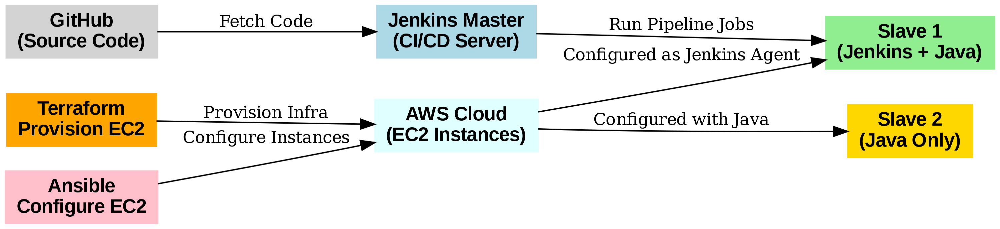

# 🚀 Infrastructure Automation with Terraform, Ansible & Jenkins

## 📌 Project Overview
This project automates the provisioning of infrastructure and configuration management on AWS using **Terraform and Ansible**.  
A Jenkins pipeline was then created to fetch code from GitHub and set up a continuous integration workflow.  

---

## 🛠️ Tools & Technologies
- **Infrastructure as Code:** Terraform  
- **Configuration Management:** Ansible  
- **CI/CD:** Jenkins  
- **Version Control:** Git, GitHub  
- **Cloud:** AWS EC2  

---

## ⚙️ Architecture
  

---

## 🚀 Implementation Steps
1. **Terraform Automation**
   - Wrote Terraform scripts to create **3 AWS EC2 instances** in default VPC and subnet.  
   - Automated installation of dependencies using **user_data scripts**.  

2. **Ansible Setup**
   - Configured one EC2 instance as **Ansible Master**.  
   - Configured two EC2 instances as **Ansible Slaves**.  
   - Established **passwordless SSH** and updated `/etc/ansible/hosts`.  

3. **Playbooks Execution**
   - Installed **Java + Jenkins** on one slave.  
   - Installed **Java** on another slave.  

4. **Jenkins Configuration**
   - Set up Jenkins dashboard on the Master node.  
   - Added another machine as Jenkins Agent.  

5. **Pipeline Job**
   - Created a **Pipeline Script (Jenkinsfile)** to fetch source code from GitHub.  
   - Verified that Jenkins successfully cloned the repo onto the slave.

---

## ✅ Outcomes
- Automated **infrastructure provisioning** with Terraform.  
- Centralized configuration management using **Ansible**.  
- CI/CD pipeline setup with **Jenkins** integrated to GitHub.

